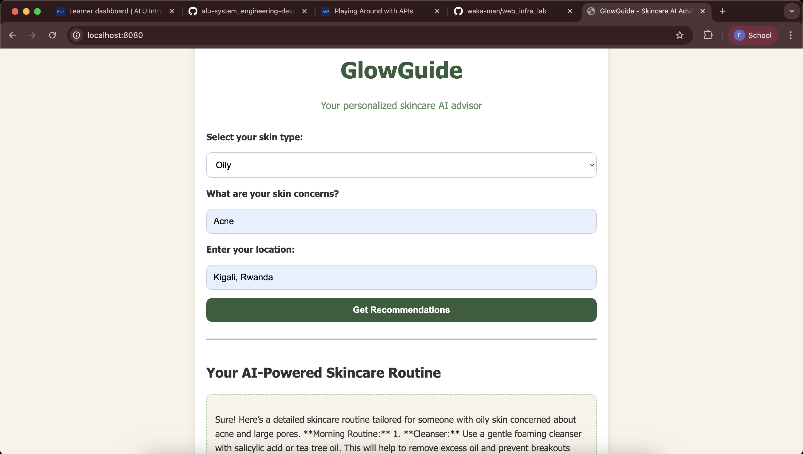

# GlowGuide - Skincare AI Advisor

A personalized skincare recommendation web application that provides customized routines, product recommendations, and dermatologist suggestions based on user input. This application serves a genuine purpose by helping users create personalized skincare routines tailored to their specific skin type and concerns.

## **Application Purpose & Value**

GlowGuide addresses a real need in the skincare industry by providing:
- **Personalized Skincare Routines**: AI-generated routines based on skin type and concerns
- **Product Recommendations**: Curated product suggestions
- **Dermatology Center Finder**: Suggest dermatology centers to visit in Kigali
- **Educational Content**: Detailed explanations of skincare steps and product benefits

This application provides genuine value by helping users navigate the overwhelming world of skincare products and routines, making dermatological care more accessible.

## **Features**

- **AI-Powered Skincare Routines**: Personalized morning and evening routines using OpenAI
- **Product Recommendations**: Real product suggestions
- **Dermatology Center Suggestions**: Suggests nearby dermatology centers with ratings and contact info
- **Responsive Design**: Works seamlessly on desktop 
- **User-Friendly Interface**: Clean, modern UI with intuitive form design

## **APIs Used**

### 1. **OpenAI API (via RapidAPI)**
- **Endpoint**: `https://open-ai21.p.rapidapi.com/conversationllama`
- **Purpose**: Generate personalized skincare routines
- **Documentation**: [RapidAPI OpenAI](https://rapidapi.com/open-ai21-open-ai21-default/api/openai-api/)
- **Rate Limits**: 100 requests/month (free tier)


## **File Structure**

```
├── glowguide.html      # Main HTML file
├── styles.css          # CSS styling
├── script.js           # JavaScript functionality
├── config.js           # API configuration (excluded from git)
├── Dockerfile          # Docker containerization
├── nginx.conf          # Nginx configuration
├── .gitignore          # Git ignore rules
└── README.md          # This file
```

## **Local Development**

### Prerequisites
- Web browser (Chrome, Firefox, Safari, Edge)
- No additional dependencies required (pure HTML/CSS/JS)

### Setup Instructions

1. **Clone the repository**:
   ```bash
   git clone <repo-url>
   cd glowguide
   ```

2. **Configure API Keys** (optional for testing):
   - Open `config.js`
   - Replace placeholder API keys with your actual RapidAPI keys
   - Note: The application includes fallback data if APIs are unavailable

3. **Run locally**:
   - Open `glowguide.html` in your web browser

---

## 🌐 Server Architecture

| Server   | IP Address      | Role           | Port |
|----------|------------------|----------------|------|
| Web01    | 40.89.191.190      | Static Web App | 8080 |
| Web02    | 172.189.157.7      | Static Web App | 8080 |
| Lb01     | 4.233.58.81     | Load Balancer  | 8082 |

---

## **Docker Deployment**


1. **Build the Docker image**:
   ```bash
   docker build -t tiffanygif/glowguide:v1 .
   ```

2. **Test locally**:
   ```bash
   docker run -p 8080:8080 tiffanygif/glowguide:v1
   curl http://localhost:8080
   ```


3. **Push to Docker Hub**:
   ```bash
   docker login
   docker push tiffanygif/glowguide:v1
   ```

### Image Details
- **Docker Hub Repository**: `tiffanygif/glowguide`
- **Image Name**: `glowguide`
- **Tags**: `v1`, `latest`
- **Base Image**: `nginx:alpine`
- **Port**: `8080`

## **Lab Machine Deployment**

### Prerequisites
- Access to web-01, web-02, and lb-01 lab machines
- Docker Hub account with your image pushed
- SSH access to all machines

### Step 1: Build and Push Your Image

Replace `your-dockerhub-username` with your actual Docker Hub username:

```bash

docker build -t glowguide:v1 .

docker tag glowguide:v1 tiffanygif/glowguide:v1

docker login

docker push tiffanygif/glowguide:v1
```

### Step 2: Deploy on Web-01

```bash
ssh user@web-01

docker pull tiffanygif/glowguide:v1

docker run -d --name glowguide-app --restart unless-stopped \
  -p 8080:8080 tiffanygif/glowguide:v1

curl http://localhost:8080

docker ps
docker logs glowguide-app
```

### Step 3: Deploy on Web-02

```bash
ssh azureuser@wweb-01

docker pull tiffanygif/glowguide:v1

docker run -d --name glowguide-app --restart unless-stopped \
  -p 8080:8080 tiffanygif/glowguide:v1

curl http://localhost:8080

docker ps
docker logs glowguide-app
```

 

### Step 4: Configure Load Balancer

```bash
ssh azureuser@lb-01

sudo nano /etc/haproxy/haproxy.cfg
```

Add or update the backend section in `/etc/haproxy/haproxy.cfg`:

```haproxy
global
    daemon
    maxconn 4096

defaults
    mode http
    timeout connect 5000ms
    timeout client 50000ms
    timeout server 50000ms

frontend http_front
    bind *:80
    default_backend webapps

backend webapps
    balance roundrobin
    server web01 172.20.0.11:8080 check
    server web02 172.20.0.12:8080 check
```

Reload HAProxy:

```bash
docker exec -it lb-01 sh -c 'haproxy -sf $(pidof haproxy) -f /etc/haproxy/haproxy.cfg'

docker exec -it lb-01 haproxy -c -f /etc/haproxy/haproxy.cfg
```

### Step 5: Test the Deployment

#### Test Individual Servers:
```bash
curl http://40.89.191.190:8080

curl http://172.189.157.7:8080
```

### Step 6: Verify End-to-End Functionality

1. **Access through load balancer**: Visit `http://lb-01` in your browser
2. **Test form submission**: Fill out the skincare form and verify responses
3. **Check API functionality**: Ensure all features work through the load balancer
4. **Monitor logs**: Check container logs for any errors

```bash
ssh azureuser@web-01 "docker logs glowguide"
ssh azureuser@web-02 "docker logs glowguide"
```

## **Security Considerations**

### API Key Management
- **Development**: API keys stored in `config.js` (excluded from git)
- **Production**: Use environment variables or Docker secrets
- **Never commit real API keys** to version control

### Security Headers
- X-Frame-Options: SAMEORIGIN
- X-XSS-Protection: 1; mode=block
- X-Content-Type-Options: nosniff
- Content-Security-Policy: Configured for external APIs

### Input Validation
- All user inputs are sanitized
- XSS protection implemented
- Error handling for malformed requests

## **Testing**

### Local Testing
1. **Functionality Test**:
   - Fill out the form with different skin types
   - Verify API responses and error handling
   - Test fallback data when APIs are unavailable

### Deployment Testing
1. **Container Health**:
   ```bash
   docker ps
   docker logs glowguide-app
   ```

2. **Load Balancer Test**:
   ```bash
   curl -I http://localhost
   ```

3. **End-to-End Test**:
   - Access application through load balancer
   - Submit form and verify all features work
   - Check error handling with invalid inputs

## 📊 **Performance Optimization**

### Implemented Optimizations
- **Gzip Compression**: Enabled for all text-based files
- **Static File Caching**: 1-year cache for static assets
- **CDN Ready**: Static files can be served from CDN
- **Minimal Container Size**: Using Alpine Linux base image

### Monitoring
- **Health Check Endpoint**: `/health`
- **Access Logs**: Detailed request logging
- **Error Logs**: Comprehensive error tracking

## **Troubleshooting**

### Common Issues

1. **"API request failed"**:
   - Check API keys in `config.js`
   - Verify RapidAPI subscription status
   - Check network connectivity

2. **"No dermatologists found"**:
   - Try different location names
   - Check API quota limits
   - Verify Google Places API configuration

3. **Container won't start**:
   ```bash
   docker logs glowguide-app
   docker exec -it glowguide-app nginx -t
   ```

4. **Load balancer not working**:
   ```bash
   docker exec -it lb-01 haproxy -c -f /etc/haproxy/haproxy.cfg
   
   docker exec -it lb-01 haproxy -c -f /etc/haproxy/haproxy.cfg | grep -A 10 "backend webapps"
   ```

5. **SSH connection issues**:
   ```bash
   # Verify SSH access
   ssh -o ConnectTimeout=10 azureuser@web-01
   ssh -o ConnectTimeout=10 azureuser@web-02
   ssh -o ConnectTimeout=10 azureuser@lb-01
   ```

6. **Docker pull fails**:
   ```bash
   # Check Docker Hub login
   docker login
   
   # Verify image exists
   docker search your-dockerhub-username/glowguide
   ```

## **Future Enhancements**

### Planned Features
- **User Authentication**: Save personalized routines
- **Product Database**: Local database of skincare products
- **Image Recognition**: Analyze skin conditions from photos
- **Progress Tracking**: Monitor skincare journey over time

### Technical Improvements
- **Backend API**: Node.js/Express server for better security
- **Database Integration**: PostgreSQL for user data
- **Caching Layer**: Redis for API response caching
- **CI/CD Pipeline**: Automated testing and deployment

## **Challenges & Solutions**

### Challenges Encountered
1. **API Rate Limits**: Implemented fallback data for reliability
2. **CORS Issues**: Used RapidAPI to avoid cross-origin problems
3. **Container Networking**: Configured proper port mapping
4. **Load Balancer Configuration**: Researched HAProxy syntax

### Solutions Implemented
1. **Graceful Degradation**: App works even when APIs are down
2. **Error Handling**: Comprehensive error messages for users
3. **Docker Best Practices**: Multi-stage builds and security headers
4. **Documentation**: Detailed setup and troubleshooting guides

## **Credits & Resources**

### APIs Used
- **OpenAI API**: [RapidAPI OpenAI](https://rapidapi.com/open-ai21-open-ai21-default/api/openai-api/)

### Technologies Used
- **Frontend**: HTML5, CSS3, JavaScript (ES6+)
- **Containerization**: Docker, Nginx
- **Load Balancing**: HAProxy
- **Deployment**: Docker Hub, Linux containers